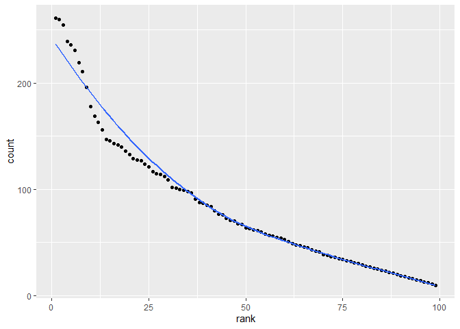

hw2 to Jeff from gx2144
================
Guangling Xu
9/30/2019

## Import and Clean data

``` r
library(tidyverse)
```

    ## -- Attaching packages ----------------------------------------------------------- tidyverse 1.2.1 --

    ## v ggplot2 3.2.1     v purrr   0.3.2
    ## v tibble  2.1.3     v dplyr   0.8.3
    ## v tidyr   1.0.0     v stringr 1.4.0
    ## v readr   1.3.1     v forcats 0.4.0

    ## -- Conflicts -------------------------------------------------------------- tidyverse_conflicts() --
    ## x dplyr::filter() masks stats::filter()
    ## x dplyr::lag()    masks stats::lag()

``` r
library(readxl)
library(ggplot2)
```

``` r
p1data = 
  read_excel("./data/Trash-Wheel-Collection-Totals-8-6-19.xlsx", sheet = 1 ,range = "A2:N388" ) %>%
  janitor::clean_names() %>% 
  na.omit(p1data, cols = " dumpster") %>% 
  mutate(
    sports_balls = as.integer(round(sports_balls), digits = 0)
  )

p1data1 = 
  read_excel("./data/Trash-Wheel-Collection-Totals-8-6-19.xlsx", sheet = 3 , range = "A2:B15") %>% 
  janitor::clean_names() %>% 
  na.omit(p1data1) %>% 
  mutate(year = c(2018),
         month = as.numeric(month),
         month = month.name[month]
   )
```

    ## Warning: NAs introduced by coercion

``` r
p1data2 = 
  read_excel("./data/Trash-Wheel-Collection-Totals-8-6-19.xlsx", sheet = 4 , range = "A2:B15") %>%
  janitor::clean_names() %>%
  na.omit(p1data2) %>% 
  mutate(year = c(2017),
         month = as.numeric(month),
         month = month.name[month]
  )

mergedata = full_join(p1data1 , p1data2) 
```

    ## Joining, by = c("month", "year")

``` r
mergedata
```

    ## # A tibble: 13 x 4
    ##    dumpster month     year total
    ##       <dbl> <chr>    <dbl> <dbl>
    ##  1        1 <NA>      2018 NA   
    ##  2        2 <NA>      2018 NA   
    ##  3        3 <NA>      2018 NA   
    ##  4        4 <NA>      2018 NA   
    ##  5        5 <NA>      2018 NA   
    ##  6        6 <NA>      2018 NA   
    ##  7        7 <NA>      2018 NA   
    ##  8       NA January   2017  3.1 
    ##  9       NA February  2017  3.64
    ## 10       NA March     2017  4.47
    ## 11       NA April     2017  1.46
    ## 12       NA May       2017  3.58
    ## 13       NA June      2017  0.42

## Summary data

  - There are 337 rows and 14 columns in sheet“Mr.Trash Wheel”. Vriable
    names are “dumpster”,“month”,“year”,“date”,“weight (tons)”,“volume
    (cubic yards)”, “plastic bottles”,“polystyrene”,“cigarette
    butts”,“glass bottles”,“grocery bags”,“chip bags”, “sports
    balls”,"homes powered\*"

“dumpster” means the number of bins;

“month”, “day”, “year” are varaibles denoting the date of collection

“weight” and “volumn” are variables denoting the amount of the trash

“plastic bottles”,“polystyrene”,“cigarette butts”,“glass
bottles”,“grocery bags”,“chip bags” are variables denoting the type
of the trash

  - There are 20 rows and 3 columns in sheet“mergedata”. Variable names
    are “month”,“total” and “year”

  - The total precipitation in 2018 is 23.50

  - The median number of sports balls in a dumpster in 2017 is 10

## Problem 2

## Import and Clean Data

``` r
pols_month = 
  read.csv("./data/pols-month.csv") %>% 
  janitor::clean_names() %>%
  separate(mon, into = c("year", "month","day"), sep = "-") %>%
  mutate(
         month = as.numeric(month),
         month = month.abb[month],
         president = recode(prez_gop, "0" = "gop", "1" = "dem" , "2" = "gop2")
         ) %>% 
  select(-prez_dem) %>% 
  select(-prez_gop) %>% 
  select(-day)
         

snp = 
  read.csv("./data/snp.csv") %>% 
  janitor::clean_names() %>%
  separate(date, into = c("month", "day", "year"), sep = "/") %>%
  mutate( 
    month = as.numeric(month)
  ) %>% 
  arrange(year,month) %>% 
  select("year","month",everything()) %>% 
  mutate(
    month = month.abb[month])

unemplyment = 
  read.csv("./data/unemployment.csv")
unemplyment = 
  pivot_longer(
    unemplyment, 
    Jan:Dec,
    names_to = "month", 
    values_to = "unemplyment") %>% 
  rename(year = Year)  %>%
  mutate(
    year = as.character(year)
  )
```

## Merge data

``` r
result = 
  left_join(pols_month,snp)
```

    ## Joining, by = c("year", "month")

``` r
finalresult = 
  left_join(result, unemplyment, by = "year")
head(finalresult,5)
```

    ##   year month.x gov_gop sen_gop rep_gop gov_dem sen_dem rep_dem president
    ## 1 1947     Jan      23      51     253      23      45     198       gop
    ## 2 1947     Feb      23      51     253      23      45     198       gop
    ## 3 1947     Mar      23      51     253      23      45     198       gop
    ## 4 1947     Apr      23      51     253      23      45     198       gop
    ## 5 1947     May      23      51     253      23      45     198       gop
    ##    day close month.y unemplyment
    ## 1 <NA>    NA    <NA>          NA
    ## 2 <NA>    NA    <NA>          NA
    ## 3 <NA>    NA    <NA>          NA
    ## 4 <NA>    NA    <NA>          NA
    ## 5 <NA>    NA    <NA>          NA

``` r
tail(finalresult,5)## show part of the table
```

    ##      year month.x gov_gop sen_gop rep_gop gov_dem sen_dem rep_dem
    ## 9728 2015     Jun      31      54     246      18      44     188
    ## 9729 2015     Jun      31      54     246      18      44     188
    ## 9730 2015     Jun      31      54     246      18      44     188
    ## 9731 2015     Jun      31      54     246      18      44     188
    ## 9732 2015     Jun      31      54     246      18      44     188
    ##      president day   close month.y unemplyment
    ## 9728       gop   1 2063.11     Aug          NA
    ## 9729       gop   1 2063.11     Sep          NA
    ## 9730       gop   1 2063.11     Oct          NA
    ## 9731       gop   1 2063.11     Nov          NA
    ## 9732       gop   1 2063.11     Dec          NA

## Problem 3

## Import and Clean Data

``` r
names = 
  read.csv("./data/Popular_Baby_Names.csv") %>% 
  janitor::clean_names() %>% 
  mutate(
    gender = str_to_lower(gender),
    ethnicity = str_to_lower(ethnicity),
    ethnicity = recode(ethnicity, "asian and paci" = "asian and pacific islander",
                       "black non hisp" = "black non hispanic" , 
                       "white non hisp" = "white non hispanic"),
    
   child_s_first_name = str_to_title(child_s_first_name)
   ) %>% 
  distinct()
```

## Filter data of Olivia

``` r
olivia = 
  filter(names, child_s_first_name == "Olivia" , gender == "female") %>% 
  select(-count) 
pivot_wider(olivia, 
              names_from = year_of_birth, 
              values_from = rank)  
```

    ## # A tibble: 4 x 9
    ##   gender ethnicity child_s_first_n~ `2016` `2015` `2014` `2013` `2012`
    ##   <chr>  <chr>     <chr>             <int>  <int>  <int>  <int>  <int>
    ## 1 female asian an~ Olivia                1      1      1      3      3
    ## 2 female black no~ Olivia                8      4      8      6      8
    ## 3 female hispanic  Olivia               13     16     16     22     22
    ## 4 female white no~ Olivia                1      1      1      1      4
    ## # ... with 1 more variable: `2011` <int>

## Scatterplot

``` r
male_name = 
    filter(names, gender == "male" ,year_of_birth == "2016", 
           ethnicity == "white non hispanic" ) 
male_nameplot = ggplot(male_name, aes(x = rank, y = count ))+
  geom_point()+
  geom_smooth(se = FALSE)
male_nameplot
```

    ## `geom_smooth()` using method = 'loess' and formula 'y ~ x'

<!-- -->

``` r
ggsave("male_name.pdf" , male_nameplot , width = 8, height = 5 )
```

    ## `geom_smooth()` using method = 'loess' and formula 'y ~ x'
