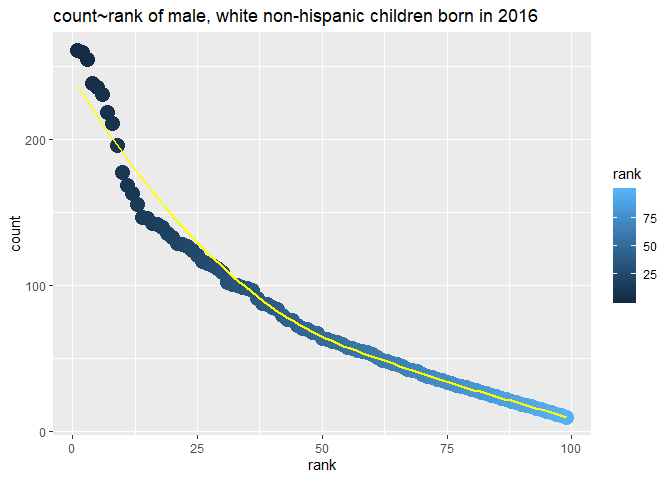

hw2 to Jeff from gx2144
================
Guangling Xu
9/30/2019

## Import and Clean data

``` r
library(tidyverse)
library(readxl)
library(ggplot2)
```

``` r
p1data = 
  read_excel("./data/Trash-Wheel-Collection-Totals-8-6-19.xlsx", sheet = 1 ,range = "A2:N388" ) %>%
  janitor::clean_names() %>% 
  na.omit(p1data, cols = " dumpster") %>% 
  mutate(
    sports_balls = as.integer(round(sports_balls), digits = 0)
  )
head(p1data)
```

    ## # A tibble: 6 x 14
    ##   dumpster month  year date                weight_tons volume_cubic_ya~
    ##      <dbl> <chr> <dbl> <dttm>                    <dbl>            <dbl>
    ## 1        1 May    2014 2014-05-16 00:00:00        4.31               18
    ## 2        2 May    2014 2014-05-16 00:00:00        2.74               13
    ## 3        3 May    2014 2014-05-16 00:00:00        3.45               15
    ## 4        4 May    2014 2014-05-17 00:00:00        3.1                15
    ## 5        5 May    2014 2014-05-17 00:00:00        4.06               18
    ## 6        6 May    2014 2014-05-20 00:00:00        2.71               13
    ## # ... with 8 more variables: plastic_bottles <dbl>, polystyrene <dbl>,
    ## #   cigarette_butts <dbl>, glass_bottles <dbl>, grocery_bags <dbl>,
    ## #   chip_bags <dbl>, sports_balls <int>, homes_powered <dbl>

``` r
p1data1 = 
  read_excel("./data/Trash-Wheel-Collection-Totals-8-6-19.xlsx", sheet = "2018 Precipitation", range = "A2:B15") %>% 
  janitor::clean_names() %>% 
  na.omit(p1data1) %>% 
  mutate(year = c(2018),
         month = as.numeric(month),
         month = month.name[month]
   )

  
p1data2 = 
  read_excel("./data/Trash-Wheel-Collection-Totals-8-6-19.xlsx", sheet = "2017 Precipitation" , range = "A2:B15") %>%
  janitor::clean_names() %>%
  na.omit(p1data2) %>% 
  mutate(year = c(2017),
         month = as.numeric(month),
         month = month.name[month]
  )

mergedata = bind_rows(p1data1 , p1data2) 
head（mergedata）
```

    ## # A tibble: 6 x 3
    ##   month    total  year
    ##   <chr>    <dbl> <dbl>
    ## 1 January   0.94  2018
    ## 2 February  4.8   2018
    ## 3 March     2.69  2018
    ## 4 April     4.69  2018
    ## 5 May       9.27  2018
    ## 6 June      4.77  2018

``` r
tail (mergedata)
```

    ## # A tibble: 6 x 3
    ##   month     total  year
    ##   <chr>     <dbl> <dbl>
    ## 1 July       7.09  2017
    ## 2 August     4.44  2017
    ## 3 September  1.95  2017
    ## 4 October    0     2017
    ## 5 November   0.11  2017
    ## 6 December   0.94  2017

## Summary data

  - There are 337 rows and 14 columns in sheet“Mr.Trash Wheel”. Vriable
    names are “dumpster”,“month”,“year”,“date”,“weight (tons)”,“volume
    (cubic yards)”, “plastic bottles”,“polystyrene”,“cigarette
    butts”,“glass bottles”,“grocery bags”,“chip bags”, “sports
    balls”,"homes powered\*"

“dumpster” means the number of bins;

“month”, “day”, “year” are varaibles denoting the date of collection

“weight” and “volumn” are variables denoting the amount of the trash

“plastic bottles”,“polystyrene”,“cigarette butts”,“glass
bottles”,“grocery bags”,“chip bags”are variables denoting the type
of the trash

  - There are 18 rows and 3 columns in sheet“mergedata”. Variable names
    are “month”,“total” and “year”

  - The total precipitation in 2018 is 70.33

<!-- end list -->

``` r
sum(pull(p1data1,total))
```

    ## [1] 70.33

  - The median number of sports balls in a dumpster in 2017 is 8

<!-- end list -->

``` r
median(pull(p1data,sports_balls))
```

    ## [1] 8

## Problem 2

## Import and Clean Data

``` r
pols_month = 
  read.csv("./data/pols-month.csv") %>% 
  janitor::clean_names() %>%
  separate(mon, into = c("year", "month","day"), sep = "-") %>%
  mutate(
         month = as.numeric(month),
         month = month.abb[month],
         president = recode(prez_gop, "0" = "gop", "1" = "dem" , "2" = "gop2")
         ) %>% 
  select(-prez_dem) %>% 
  select(-prez_gop) %>% 
  select(-day)
         

snp = 
  read.csv("./data/snp.csv") %>% 
  janitor::clean_names() %>%
  separate(date, into = c("month", "day", "year"), sep = "/") %>%
  mutate( 
    month = as.numeric(month)
  ) %>% 
  arrange(year,month) %>% 
  select("year","month",everything()) %>% 
  mutate(
    month = month.abb[month])

unemployment = 
  read.csv("./data/unemployment.csv")
unemployment = 
  pivot_longer(
    unemployment, 
    Jan:Dec,
    names_to = "month", 
    values_to = "unemployment") %>% 
  rename(year = Year)  %>%
  mutate(
    year = as.character(year)
  )
```

## Merge data

``` r
result = 
  left_join(pols_month,snp)
```

    ## Joining, by = c("year", "month")

``` r
finalresult = 
  left_join(result, unemployment, by = c("year","month"))
head(finalresult,5)
```

    ##   year month gov_gop sen_gop rep_gop gov_dem sen_dem rep_dem president
    ## 1 1947   Jan      23      51     253      23      45     198       gop
    ## 2 1947   Feb      23      51     253      23      45     198       gop
    ## 3 1947   Mar      23      51     253      23      45     198       gop
    ## 4 1947   Apr      23      51     253      23      45     198       gop
    ## 5 1947   May      23      51     253      23      45     198       gop
    ##    day close unemployment
    ## 1 <NA>    NA           NA
    ## 2 <NA>    NA           NA
    ## 3 <NA>    NA           NA
    ## 4 <NA>    NA           NA
    ## 5 <NA>    NA           NA

``` r
tail(finalresult,5)## show part of the table
```

    ##     year month gov_gop sen_gop rep_gop gov_dem sen_dem rep_dem president
    ## 818 2015   Feb      31      54     245      18      44     188       gop
    ## 819 2015   Mar      31      54     245      18      44     188       gop
    ## 820 2015   Apr      31      54     244      18      44     188       gop
    ## 821 2015   May      31      54     245      18      44     188       gop
    ## 822 2015   Jun      31      54     246      18      44     188       gop
    ##     day   close unemployment
    ## 818   2 2104.50          5.5
    ## 819   2 2067.89          5.5
    ## 820   1 2085.51          5.4
    ## 821   1 2107.39          5.5
    ## 822   1 2063.11          5.3

\*\*summary datasets

There are 9 columns and 822 rows in pols\_month dataset.Variable names
are “year”,“month”,“prez\_gop”,“sen\_gop”
“rep\_gop”,“prez\_dem”,“gov\_dem”,“sen\_dem”,“rep\_dem”.Year
ranges from 1974\~2015.

There are 4 columns and 787 rows in snp dataset. Variable names are
“year”,“month”,“day”,“close”.Year ranges from 1950\~2015.

There are 3 colunms and 816 rows in unemplyment dataset. Variable names
are “year”,“month”,“unemployment”Year ranges from 1948\~2015.

## Problem 3

## Import and Clean Data

``` r
names = 
  read.csv("./data/Popular_Baby_Names.csv") %>% 
  janitor::clean_names() %>% 
  mutate(
    gender = str_to_lower(gender),
    ethnicity = str_to_lower(ethnicity),
    ethnicity = recode(ethnicity, "asian and paci" = "asian and pacific islander",
                       "black non hisp" = "black non hispanic" , 
                       "white non hisp" = "white non hispanic"),
    
   child_s_first_name = str_to_title(child_s_first_name)
   ) %>% 
  distinct()
```

## Filter data of Olivia

``` r
olivia = 
  filter(names, child_s_first_name == "Olivia" , gender == "female") %>% 
  select(-count,-child_s_first_name,-gender) %>% 
pivot_wider(
              names_from = year_of_birth, 
              values_from = rank) 
knitr::kable(olivia)
```

| ethnicity                  | 2016 | 2015 | 2014 | 2013 | 2012 | 2011 |
| :------------------------- | ---: | ---: | ---: | ---: | ---: | ---: |
| asian and pacific islander |    1 |    1 |    1 |    3 |    3 |    4 |
| black non hispanic         |    8 |    4 |    8 |    6 |    8 |   10 |
| hispanic                   |   13 |   16 |   16 |   22 |   22 |   18 |
| white non hispanic         |    1 |    1 |    1 |    1 |    4 |    2 |

## Table of most popular name among male children

``` r
popmalename = 
  filter(names,rank == 1, gender =="male") %>% 
  select(-count, -gender,-rank) %>% 
pivot_wider(
              names_from = year_of_birth, 
              values_from = child_s_first_name
              ) 
knitr::kable(popmalename)
```

| ethnicity                  | 2016   | 2015   | 2014   | 2013   | 2012   | 2011    |
| :------------------------- | :----- | :----- | :----- | :----- | :----- | :------ |
| asian and pacific islander | Ethan  | Jayden | Jayden | Jayden | Ryan   | Ethan   |
| black non hispanic         | Noah   | Noah   | Ethan  | Ethan  | Jayden | Jayden  |
| hispanic                   | Liam   | Liam   | Liam   | Jayden | Jayden | Jayden  |
| white non hispanic         | Joseph | David  | Joseph | David  | Joseph | Michael |

## Scatterplot

``` r
male_name = 
    filter(names, gender == "male" ,year_of_birth == "2016", 
           ethnicity == "white non hispanic" ) 
male_nameplot = ggplot(male_name, aes(x = rank, y = count,color = rank ))+
  geom_point(size = 5)+
  geom_smooth(se = FALSE,color="yellow")+
  labs(
    title = "count~rank of male, white non-hispanic children born in 2016"
  )
male_nameplot
```

    ## `geom_smooth()` using method = 'loess' and formula 'y ~ x'

<!-- -->

``` r
ggsave("male_name.pdf" , male_nameplot , width = 8, height = 5 )
```

    ## `geom_smooth()` using method = 'loess' and formula 'y ~ x'
